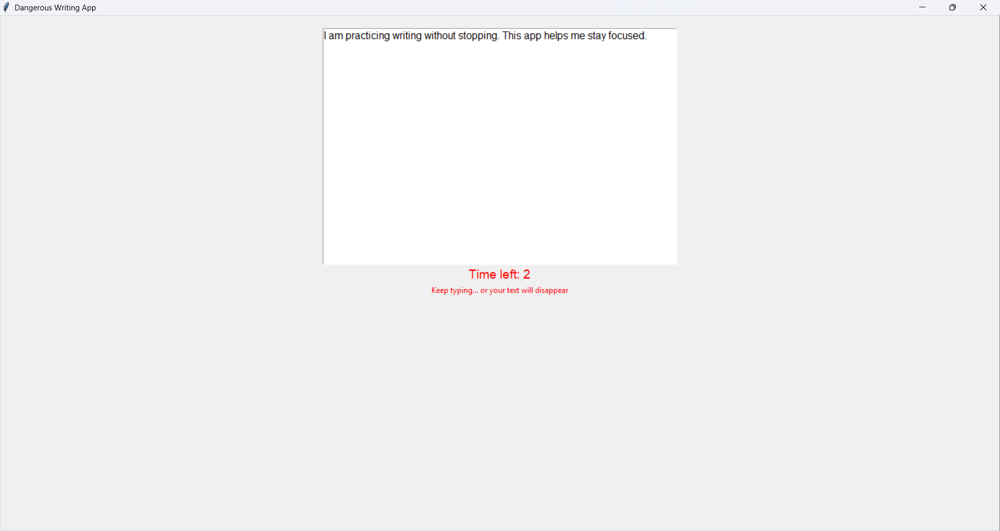

# ⌨️ Dangerous Writing App

A desktop application built using **Python** and **Tkinter** that challenges users to keep typing without stopping.

## 🚀 Features
- Real-time typing detection
- Countdown timer (5 seconds)
- Automatically deletes text if user stops typing
- Simple and clean GUI interface

## 🧰 Technologies Used
- Python
- Tkinter

## 🧠 How It Works
- The app starts a countdown timer when the user begins typing.
- Each key press resets the timer.
- If no typing is detected for 5 seconds, all the text is deleted automatically.

## 📸 Screenshot

